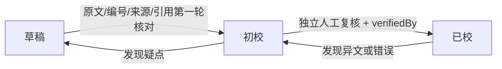

# 内容审核工作流

## 目标

把“内容已经发布”和“内容已经校对”彻底分开。

网站允许草稿进入学习环境，但必须公开状态；高可信状态必须有更严格证据。

## 状态机



## 草稿 → 初校

Reviewer 应逐项检查：

1. 条文编号与目标版本是否一致。
2. 原文是否存在漏字、错字、标点导致的语义变化。
3. sourceName/sourceEdition/sourceUrl 是否准确。
4. formulaSlug、clauseIds 是否正确。
5. 白话解释是否只做学习解释，没有冒充原文。
6. 安全提示是否足够。
7. 填写 reviewedAt。

## 初校 → 已校

必须由另一位人工复核者完成。

要求：

- 复看原典或可靠整理本；
- 重点检查存在版本差异的句子；
- 检查方剂组成名称及条文关联；
- 检查白话是否加入了原文没有的确定性结论；
- 填写 verifiedBy；
- 保留 reviewedAt。

## 降级

任何阶段发现疑问都可以降级：

```text
已校 → 初校
初校 → 草稿
```

降级不是失败，而是避免让不确定内容以更高可信状态继续传播。

## CI 门禁

`npm run content:check` 当前自动检查：

- ID / 编号 / slug 重复；
- 必填字段；
- 来源 URL；
- 条文 ↔ 方剂断链；
- 对比页左右方剂断链；
- 对比维度格式；
- 初校缺少 reviewedAt；
- 已校缺少 reviewedAt；
- 已校缺少 verifiedBy。

## 当前 v0.3.1 策略

v0.3 已存在并做过第一轮整理的内容继续保留为“初校”。

v0.3.1 大规模新增太阳篇内容统一先标记为“草稿”。后续可以按编号逐批推进：

```text
1–20
21–40
41–74
...
```

每批完成实际复核后再提升状态。

## 状态含义边界

“已校”只表示 **本项目内部内容流程已完成双重审核**。

它不代表：

- 医学指南；
- 医疗机构认证；
- 临床治疗建议；
- 可替代医师判断。
